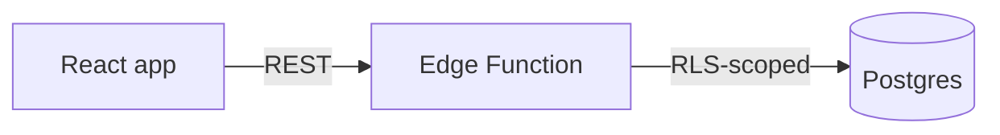

# Architecture Diagram

## Trigger
- Onboarding someone to the system.
- Documenting a design decision.
- A flow is hard to explain in prose.

## Inputs needed
- Repository access.
- Which slice to diagram — the whole system is rarely the right scope.

## Procedure
1. Pick one question the diagram should answer; that decides the scope.
2. Trace the real code — entry points, layers, data stores, external calls.
3. Choose the diagram type: flowchart for structure, sequence for a flow over time, ER for data.
4. Keep it to what fits on a screen; split rather than cram.
5. Label edges with what actually crosses them, not just an arrow.
6. Save it into the docs and verify it renders.

## Checklist
- [ ] Diagram answers one stated question
- [ ] Derived from the code, not from the old documentation
- [ ] Under roughly 15 nodes; split if larger
- [ ] Edges labelled with the data or call they represent
- [ ] External systems and trust boundaries marked
- [ ] Renders correctly in Markdown

## Output template
```


**Answers:** <the question>
**Not shown:** <deliberate omissions>
```

## Do not
- Do not diagram the whole system in one picture.
- Do not draw what the code does not do.
