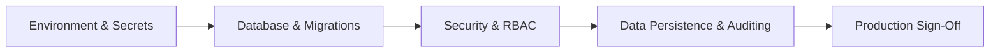

# SD Tracker WebCRM — Documentation Pack: Executive Summary & Ship Readiness

> **Document Classification**: Operations & Governance Handover  
> **Target Audience**: General Managers, Regional Managers, Property Leads, IT & System Administrators  
> **System**: SD Commercial Tracker WebCRM  
> **Version**: 1.0 (Production Release)  
> **Effective Date**: Current Production Release  

---

## 1. Purpose & Overview ("The What & Why")

### What is this Documentation Pack?
This **Documentation Pack** is the official handover and operational governance toolkit for **SD Tracker WebCRM**. It establishes the ground rules, technical procedures, support contacts, resolution timeframes, and change policies required to run, support, and evolve the application smoothly in production.

### Why is this Documentation Required?
As SD Tracker WebCRM transitions from active development into live daily operational use across hotels, accommodation properties, and regional offices:
1. **Managers need clarity**: Property and Operations Managers must know exactly whom to contact, what response times to expect (SLAs), and how defects or change requests are handled without operational downtime.
2. **Accountability & Compliance**: The CRM processes safeguarding records, maintenance defects, local authority referrals, and statutory compliance certificates. Documented SLAs and audit processes are mandatory for local authority audits and regulatory compliance.
3. **Smooth Maintenance**: Future updates, security patches, and property additions must follow a predictable, safe pipeline that avoids data loss or disruption.

---

## 2. Documentation Pack Index

This pack provides clear operational guidance tailored for business managers, operations leadership, and technical administrators:

### Interactive Browser Portal
* [**SDTracker Service & Support Interactive Portal (index.html)**](./index.html): Clean, single-page web app with tab switcher, interactive SLA table, automated RFC generator, and printable reference sheets for managers.

### Primary Manager & Business Guide
* [**SDTracker – Application Support, SLA & Change Management Guide**](./SDTracker_Application_Support_SLA_and_Change_Management_Guide.md): Concise 5-section guide covering support scope, priority & SLA solving times, change request lifecycle, escalation routes, and maintenance communications.

### Detailed Operational & Technical Guides
| Document | File Name | Key Focus & Audience |
| :--- | :--- | :--- |
| **01. Production & Environment Guide** | [01_PRODUCTION_AND_ENVIRONMENT_GUIDE.md](./01_PRODUCTION_AND_ENVIRONMENT_GUIDE.md) | Infrastructure, hosting, Supabase DB, SSL, environment variables, backup policies. |
| **02. Support & Operations Manual** | [02_APP_SUPPORT_AND_OPERATIONS_MANUAL.md](./02_APP_SUPPORT_AND_OPERATIONS_MANUAL.md) | Support tiers (Tier 1–3), day-to-day operations, user onboarding, health checks. |
| **03. SLA & Incident Remediation** | [03_SLA_AND_INCIDENT_REMEDIATION_FRAMEWORK.md](./03_SLA_AND_INCIDENT_REMEDIATION_FRAMEWORK.md) | Incident priority levels (P1 to P4), response & solving times, escalation hierarchy. |
| **04. Change Management & Release Process** | [04_CHANGE_MANAGEMENT_AND_RELEASE_PROCESS.md](./04_CHANGE_MANAGEMENT_AND_RELEASE_PROCESS.md) | How managers request changes, 9-stage lifecycle, release cadence, rollback plans. |
| **05. Manager Quick Reference Card** | [05_MANAGER_QUICK_REFERENCE_CARD.md](./05_MANAGER_QUICK_REFERENCE_CARD.md) | 2-page operational cheat sheet for property managers: contacts, SLAs, and instant fixes. |
| **06. WebCRM Brand Kit & Design System** | [06_WEBCRM_BRAND_KIT_AND_DESIGN_SYSTEM.md](./06_WEBCRM_BRAND_KIT_AND_DESIGN_SYSTEM.md) | Visual design tokens, logo geometry, Poppins typography, and Fluent UI component kit. |

---

## 3. Pre-Ship Production Readiness Checklist

Before final go-live sign-off, verify every item on this checklist:

### A. Environment & Infrastructure
- [x] **Production Domain Configured**: Custom domain with valid TLS 1.3 / SSL certificate (HTTPS enforced).
- [x] **Environment Secrets Locked**: No secret API keys or service role keys exposed in client bundles (`VITE_SUPABASE_URL` and `VITE_SUPABASE_ANON_KEY` only).
- [x] **Express Backend Running**: Node/Express server configured with reverse proxy (Nginx/Amplify/Docker) with health endpoint `/api/health`.
- [x] **CORS Configured**: Restricted to authorized production domain origins.

### B. Database & Storage
- [x] **Supabase PostgreSQL Schema Up-to-Date**: All migrations (`001_core`, `002_attachments`) applied.
- [x] **Automated Backups Active**: Point-in-Time Recovery (PITR) or daily automated snapshots enabled.
- [x] **Row-Level Security (RLS)**: Policies enforced on all tables preventing cross-property tenant data leakage.
- [x] **Attachments Cleaned**: Universal attachment handling sanitized; no orphaned base64 data URLs or ghost DOC files.

### C. Role-Based Access Control (RBAC) & Privacy
- [x] **Role Isolation Validated**:
  - `Staff` / `Support Worker`: Restricted strictly to assigned hotel property; no access to cross-site records or Super Admin settings.
  - `Site Manager`: Oversight of their specific managed property; data export for their site only.
  - `Regional Manager`: Oversight of assigned cluster of properties.
  - `Super Admin`: Enterprise-wide control, schema editor, role permissions, and full audit logs.
- [x] **Immutable Audit Trail**: Every create, update, delete, role assignment, and export is recorded in `audit_trails` with timestamp, user, role, and property tag.

### D. Automated Quality & Unit Tests
- [x] **Unit Test Suite Passed**: `npm run test:unit` passing with 0 failures (49/49 passing).
- [x] **TypeScript Typecheck**: `npm run lint` (`tsc --noEmit`) passing with 0 errors.
- [x] **Browser Storage Fallback**: Graceful offline/local sync capability tested for network dropouts.

---

## 4. Key Application Scope

SD Tracker WebCRM covers **14 core operational modules**:
1. **Commercial & Operational KPI Dashboard** (Occupancy, active defects, urgent referrals)
2. **Safeguarding Referrals** (Adult & child safeguarding, Mosaic portal tracking)
3. **Vulnerable Service Users** (Risk classifications, review dates, allocated keyworkers)
4. **Challenging Behavior Register** (Incidents, warning letters, police involvement)
5. **Maintenance & Defects Tracker** (CAT 1 Emergency 4h, CAT 2 Interim 24h, CAT 2 5-day, CAT 3)
6. **SPCD Case Tracker** (Special provision case details, departure dates)
7. **Property Laundry Log** (Weekly/monthly bag counts, variance & discrepancies)
8. **Food Vendor & Buffet Log** (Meal counts, dietary compliance, vendor performance)
9. **Public Transport Authorizations** (URN tracking, distance, appointments)
10. **SD Statutory Compliance Register** (FRA, gas safety, legionella, expiry dates)
11. **GP Appointments Register** (Consultations, attendance tracking, DNA tracking)
12. **RFA Welfare Checks** (Daily/weekly resident welfare assessments)
13. **Dispersal Sheets & Booklets** (Exit briefings, travel status, consignment inventory)
14. **Voluntary & Community Sector (VCS) Directory** (Partner charities, food banks, advocacy)
