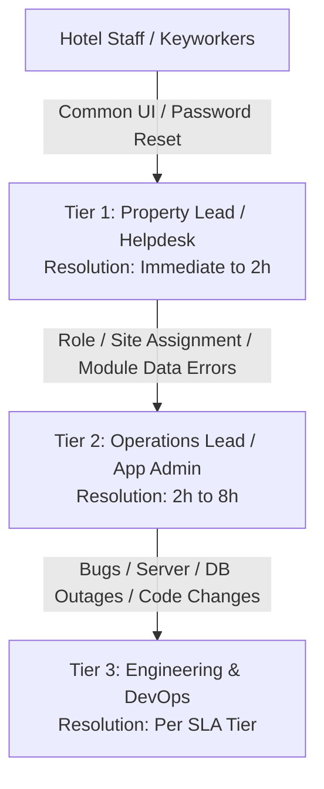

# 02. App Support & Operations Manual

> **Audience**: Site Managers, Regional Managers, IT Helpdesk, Super Admins  
> **System**: SD Commercial Tracker WebCRM  
> **Classification**: Internal Operational Standard  

---

## 1. Multi-Tiered Support Model

To maintain operational continuity and avoid bottlenecking software engineers with routine tasks, SD Tracker WebCRM operates on a **3-Tier Support Structure**:

### Tier 1: On-Site Support & Property Leads
- **Responsible For**:
  - Staff password resets and login troubleshooting.
  - Browser clearing, device compatibility (Chrome, Edge, Safari on iPad/Desktop).
  - Guidance on data entry, forms, and mandatory fields.
- **Contact**: Local Property Operations Lead / On-duty Supervisor.

### Tier 2: Application Administrators & Operations Management
- **Responsible For**:
  - User account creation, role changes (`Staff`, `Site Manager`, `Regional Manager`).
  - Property reassignment when staff rotate between hotels.
  - Customizing table columns via **Customize Table** modal.
  - Reviewing and approving **Data Change Requests**.
  - Reviewing audit trail entries for compliance investigations.
- **Contact**: `tracker-admin@sdcommercial.co.uk`

### Tier 3: Engineering & Infrastructure
- **Responsible For**:
  - Application bug fixes, core logic issues.
  - Database outages, Supabase storage quota, API latency.
  - Production deployments, emergency hotfixes, and security patching.
- **Contact**: Dedicated On-Call Engineering Team / Support Ticket Portal.

---

## 2. Daily Administrative Operations

### Routine Daily Health Checklist for Admins:
1. **API Health Probe**: Verify `https://<domain>/api/health` returns status `healthy`.
2. **Audit Trail Review**: Navigate to **Audit Trails** to scan for unexpected deletions or permission changes.
3. **Emergency Safeguarding & Incidents Check**:
   - Check the **Commercial Dashboard** KPI cards:
     - Verify active **CAT 1 Maintenance Emergencies** have been addressed within the 4-hour SLA.
     - Verify any new **Safeguarding Referrals** marked `High` urgency have local authority acknowledgement logged.
4. **Data Change Requests**:
   - Review pending requests in the **Requests** module submitted by staff seeking historical data corrections.

---

## 3. User & Access Management Procedures

### 1. Creating a New User
1. Navigate to **Users & Roles > User Accounts**.
2. Click **+ Add User**.
3. Enter Full Name, Corporate Email Address, and select:
   - **Role**: `Staff`, `Site Manager`, `Regional Manager`, or `Super Admin`.
   - **Assigned Property**: Select their primary work location (e.g. *Brit Hotel*, *Stansted Hotel*).
4. Click **Create User**. An activation invitation is dispatched.

### 2. Staff Rotating to Another Hotel
1. In **Users & Roles**, search for the staff member.
2. Click **Edit**.
3. Update the **Assigned Property** dropdown to the new location.
4. Click **Save Changes**. The user's views and permission boundaries update immediately without requiring re-login.

### 3. Immediate Staff Offboarding (Leavers)
> [!IMPORTANT]
> When a staff member leaves the organization or is suspended, revoke access immediately:
1. Open **Users & Roles > User Accounts**.
2. Click **Edit** on the user.
3. Toggle status from `Active` to `Disabled`.
4. Click **Save**.
5. All active sessions are invalidated immediately, preventing further data access.

---

## 4. Operational Troubleshooting Playbook

### Issue 1: "I cannot see any records for my hotel"
- **Cause**: User's profile is assigned to a different property or set to an inactive status.
- **Resolution**:
  1. An Admin navigates to **Users & Roles**.
  2. Inspect the user's `Assigned Property`. Ensure it matches the exact property name they are managing.
  3. Have the user click the **Reset Filters** button in their module header.

### Issue 2: "File upload failed or attachment rejected"
- **Cause**: Unsupported file format or file size exceeded.
- **Resolution**:
  - Verify file size is under **15 MB** per document.
  - Accepted formats: `.pdf`, `.docx`, `.xlsx`, `.png`, `.jpg`, `.jpeg`, `.webp`.
  - Ensure internet connection is active. Attachments are encrypted and synchronized with Supabase Storage.

### Issue 3: "A record was created by mistake or duplicated"
- **Resolution**:
  1. Only users with `Delete` permissions (`Super Admin`, `Site Manager`) can permanently delete records.
  2. If a staff member creates a duplicate, they should notify the Site Manager or submit a **Data Change Request** referencing the Record ID.
  3. When deleting, the system prompts for explicit confirmation and records a permanent `DELETE` event in `audit_trails`.

### Issue 4: "My browser crashed while filling out a long incident form"
- **Resolution**:
  - The CRM features automatic form draft persistence.
  - Re-open the form modal on the same device and browser: a banner will appear stating *"A saved draft was found"*. Click **Restore Draft** to recover all filled fields.
