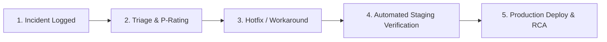

# 03. Service Level Agreements (SLA) & Incident Remediation Framework

> **Audience**: General Managers, Regional Managers, IT Leadership, Operations Directors  
> **System**: SD Commercial Tracker WebCRM  
> **Status**: Approved Production Standard  

---

## 1. Service Availability Commitment

SD Tracker WebCRM commits to a **99.9% Application Availability** SLA during core operational hours.

| Metric | Commitment | Notes |
| :--- | :--- | :--- |
| **Core Uptime** | **99.9%** | Calculated monthly, excluding scheduled maintenance. |
| **Operating Window** | **24/7/365** | Hotels and accommodation facilities operate continuously. |
| **Scheduled Maintenance Window** | Tuesdays & Thursdays 02:00 – 04:00 GMT | Minimum 48 hours advance notice to Site Managers. |

---

## 2. Incident Classification & Solving Times Matrix

Every reported defect or disruption is classified into one of four priority tiers with binding response and solving deadlines:

| Severity Tier | Definition & Examples | Initial Response SLA | Target Remediation (Solving Time) | Update Frequency to Managers |
| :--- | :--- | :---: | :---: | :--- |
| 🔴 **P1 — CRITICAL** | **SDTracker unavailable for all/majority of users or critical business operation stopped.**<br>*Example: White screen on login; database connection refused; data loss event.* | **30 Minutes**<br>*(24/7 coverage)* | **4 Hours** | Every 30 minutes until restored |
| 🟠 **P2 — HIGH** | **Major function unavailable with significant business impact; no workaround.**<br>*Example: Cannot log CAT 1 Maintenance defect; safeguarding referrals cannot be created; export crashing before council audit.* | **1 Hour**<br>*(Business hours)* | **8 Business Hours** | Every 60 minutes |
| 🟡 **P3 — MEDIUM** | **Issue affecting individual users or non-critical functionality; practical workaround available.**<br>*Example: A filter dropdown is not sorting; laundry discrepancy calculation rounding; single attachment preview failing.* | **4 Business Hours** | **3 Business Days** | Daily or upon fix |
| 🟢 **P4 — LOW** | **Minor issue, question, cosmetic issue or low-impact problem.**<br>*Example: Table column header label typo; button color discrepancy; request for a new dropdown option.* | **1 Business Day** | **5 to 10 Business Days** | Upon release notes |

---

## 3. Incident Remediation Lifecycle

When an issue occurs, the engineering and support team follows a structured 5-phase remediation process:



### Phase 1: Detection & Notification
- Incidents can be raised via the support portal, email to `tracker-support@sdcommercial.co.uk`, or automatically triggered by the `/api/health` monitoring probe.

### Phase 2: Triage & Classification
- Within the initial response window, Tier 2 / Tier 3 support assesses the impact, validates replication steps, and assigns the priority level (`P1` to `P4`).

### Phase 3: Immediate Workaround & Fix
- If an immediate fix is complex, engineering deploys a temporary safeguard/workaround to unblock hotel operations while the underlying code fix is finalized.

### Phase 4: Staging Verification & Regression Guard
- Before any code reaches production, the automated test suite must pass with 0 errors:
  ```bash
  npm run test:unit
  npm run lint
  ```
- Regression verification confirms that no neighboring modules or RBAC boundaries are altered.

### Phase 5: Production Deployment & Root Cause Analysis (RCA)
- The hotfix is released with zero downtime.
- For all **P1** and **P2** incidents, an official **Root Cause Analysis (RCA) Report** is delivered to Operations Directors within **24 hours**.

---

## 4. Escalation Hierarchy

If an incident exceeds 50% of its target solving time without resolution, it automatically escalates up the hierarchy:

```
Level 1: Support Helpdesk (First 15 mins)
   └── Level 2: Lead Systems Engineer (15 - 45 mins)
         └── Level 3: Head of IT / Engineering Director (45 - 90 mins)
               └── Level 4: Operations Executive Leadership (> 90 mins)
```

### Emergency Hotlines:
- **Critical Incident On-Call Lead**: `+44 (0) 20 XXXX XXXX`
- **Emergency Operations Desk**: `emergency-ops@sdcommercial.co.uk`

---

## 5. Incident Communication Templates for Managers

### Incident Acknowledged (Sent to Site Managers within 15 mins):
> **Subject**: [INVESTIGATING - P1/P2] SD Tracker Alert — Incident #[ID]  
> **To**: All Property Managers, Regional Leads  
> **Message**: We are currently investigating an issue affecting [Module/Service Name]. Our engineering team has been mobilized under P[X] SLA.  
> **Impact**: [Brief description of what users may experience].  
> **Next Update**: Within [30/60] minutes.

### Incident Resolved:
> **Subject**: [RESOLVED] SD Tracker Restored — Incident #[ID]  
> **To**: All Property Managers, Regional Leads  
> **Message**: The issue affecting [Module Name] has been resolved as of [Time GMT]. Normal operation is restored.  
> **Action Required**: Please refresh your browser (`Ctrl+F5` or `Cmd+Shift+R`). No data was compromised. A full RCA report will follow.
