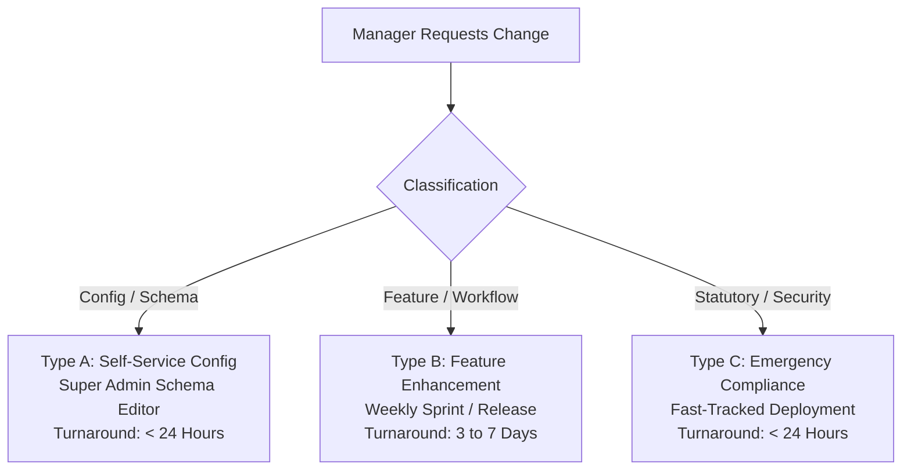

# 04. Change Management & Release Process

> **Audience**: Site Managers, Regional Directors, Product Owners, Developers  
> **System**: SD Commercial Tracker WebCRM  
> **Classification**: Governance Standard  

---

## 1. Why Change Management Matters

SD Tracker WebCRM manages sensitive operational and statutory records across multiple properties. Uncontrolled or untested code changes risk:
- Breaking scheduled Local Authority exports or audit dossiers.
- Discarding custom column schemas or table customizations.
- Causing data schema drift or sync errors between properties.

This **Change Management Standard** ensures every app change, new feature, and column modification is tracked, verified, and released without disrupting day-to-day property operations.

---

## 2. Change Categories & Turnaround Times

| Change Type | Scope & Description | Approval Level | Deployment Window |
| :--- | :--- | :--- | :--- |
| **Type A: Configuration** | Adding dropdown options, adjusting column labels, toggling visible columns via **Customize Table**. | Super Admin / Operations Lead | Immediate (< 24 Hours) |
| **Type B: Feature Request** | Adding a new module, modifying export formats, new automated email rules, new calculation logic. | Regional Operations Manager & IT Lead | Standard Weekly Release (Thursdays 03:00 GMT) |
| **Type C: Urgent / Legal** | Urgent local authority mandate, safeguarding compliance requirement, security patch. | Executive Operations Director | Fast-Track Hotfix (< 24 Hours) |

---

### 3. Change Categories
* **Bug Fix:** Existing functionality is broken or not working as expected.
* **Change:** Modifying existing behavior (e.g. adding a new field to customer/site records).
* **Enhancement:** Adding brand new features, dashboards, or reports.
* **Process Change:** Modifying how an operational workflow operates (e.g. approval stages).

---

## 4. How Managers Submit an App Change Request

Submit all change requests to `product@sdcommercial.com` or via the in-app **Requests** tab.

### Required Information for Change Requests:
1. **What needs to change?** (Clear description of the requested modification)
2. **Why is the change required?** (Operational necessity or pain point)
3. **Business benefit / reason:** (Time saved, compliance requirement, error reduction)
4. **Who will be affected?** (Specific site, all site managers, shift staff, or head office)
5. **Required date:** (Target implementation date or compliance deadline)
6. **Examples / Screenshots:** (Mockup, spreadsheet, or sample layout)
7. **Business Priority:** (Low / Medium / High / Regulatory Urgent)

---

## 5. The Change Lifecycle

All changes must be **reviewed, assessed, tested, and approved before production deployment**:

$$\text{Request} \longrightarrow \text{Review} \longrightarrow \text{Impact Assessment} \longrightarrow \text{Approval} \longrightarrow \text{Development} \longrightarrow \text{Testing} \longrightarrow \text{User Acceptance} \longrightarrow \text{Production Release} \longrightarrow \text{Verification}$$

1. **Request:** Manager submits RFC.
2. **Review:** Assessed during weekly sprint review.
3. **Impact Assessment:** Evaluates database, mobile compatibility, and report dependencies.
4. **Approval:** Operations Lead approves scope and timeline.
5. **Development:** Feature coded in isolated branch.
6. **Testing:** Unit tests (`npm run test:unit`) and type checking (`npm run lint`) pass.
7. **User Acceptance (UAT):** Requesting manager reviews and tests in staging.
8. **Production Release:** Zero-downtime release during planned maintenance window.
9. **Verification:** Operational validation confirms live success.

---

## 5. Rollback & Safeguard Strategy

In the rare event that a newly deployed release exhibits unexpected behavior:
1. **Automated Rollback**: The deployment host (AWS Amplify / Docker) maintains the previous stable artifact.
2. **One-Click Revert**: If an issue is flagged within 60 minutes of deployment, engineering triggers an immediate rollback to the previous version within **5 minutes**.
3. **Database Safeguard**: Because migrations use backward-compatible columns, reverting the frontend code does not delete or corrupt existing database records.
