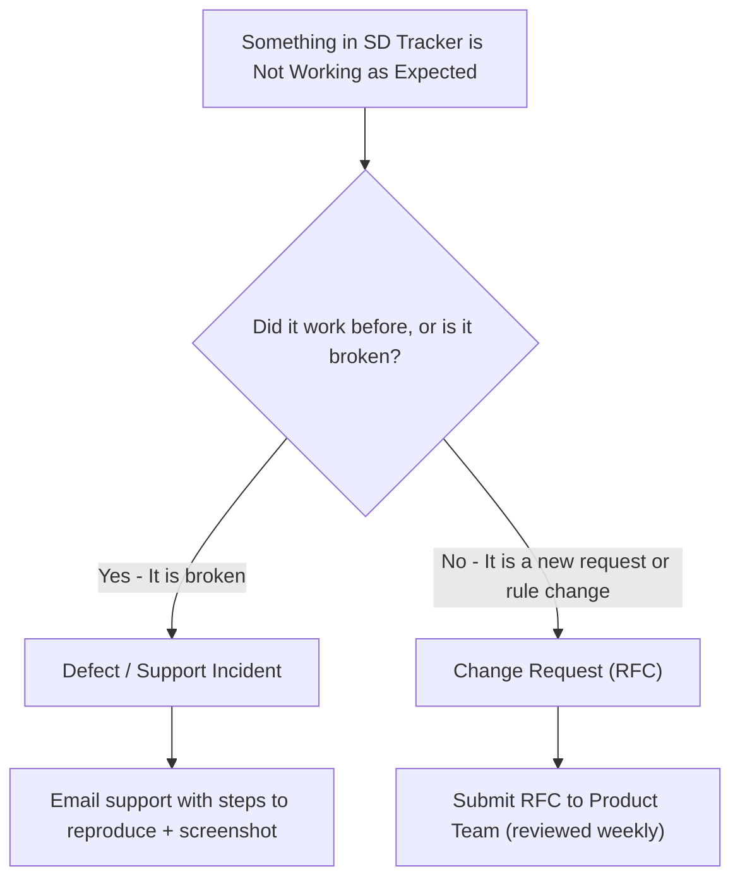

# SD Tracker WebCRM — Operations & Site Manager Quick Reference Card

> **Target Audience:** Hotel / Property General Managers, Operations Directors, and Shift Leads  
> **Purpose:** A concise 2-page operational cheat sheet explaining how to request help, report bugs, ask for system changes, and understand resolution times.

---

## 1. Quick Support Contacts

| Role | Channel | Response SLA | Coverage Hours |
| :--- | :--- | :--- | :--- |
| **Emergency Helpdesk (P1 Only)** | `helpdesk-p1@sdcommercial.com` / +44 (0) 20 8000 0111 | **< 15 Mins** | 24/7 / 365 |
| **Standard Support (P2 / P3 / P4)** | `sdtracker-support@sdcommercial.com` / In-App Ticket | **< 30 Mins (P2) / < 4 Hrs (P3/P4)** | Mon – Fri, 08:00 – 18:00 GMT |
| **Product & System Changes** | `product@sdcommercial.com` | **< 24 Hours** | Weekly Sprint Review (Every Tues) |

---

## 2. SLA Solving Times Matrix (At a Glance)

Whenever you experience an issue, review this chart to know expected turnaround times:

| Priority | What It Means | Examples | Initial Response | Solving / Workaround Target |
| :---: | :--- | :--- | :---: | :---: |
| 🔴 **P1 Critical** | **SDTracker Unavailable.** Down for all/majority of users or critical business operation stopped. | • Complete login failure • Database connection refused • Cannot save records at any property | **30 mins** *(24/7 coverage)* | **4 hours** |
| 🟠 **P2 High** | **Major Function Down.** Key workflow broken with significant business impact; no workaround. | • Daily Audit cannot submit • PDF exports timing out • Rota schedule missing for a site | **1 hour** *(Business hours)* | **8 business hours** |
| 🟡 **P3 Medium** | **Workaround Available.** Affecting individual users or non-critical functionality. | • Search filter acting sluggish • Visual glitch on chart • Single user cannot see photo attachment | **4 business hours** | **3 business days** |
| 🟢 **P4 Low** | **Minor / Cosmetic.** Typo, layout alignment, general how-to inquiry. | • Label spelled wrong • Report column order preference • General user question | **1 business day** | **5 to 10 business days** |

---

## 3. How to Report an Incident vs. Request a Change

Managers frequently ask: *"Should I email support, or is this a feature change?"* Use this rule of thumb:

### Reporting a Defect (Bug)
Send an email to `sdtracker-support@sdcommercial.com` with:
1. **Property / Site Name** (e.g. *Crown Plaza - Manchester*).
2. **Page or Module** (e.g. *Daily Audits -> Health & Safety*).
3. **Exact Steps Taken** (e.g. *"Clicked 'Sign & Submit' with 3 photo attachments"*).
4. **Error Message or Screenshot** (take a phone photo or screenshot of the red alert box).

### Requesting a Change or New Feature
Email `product@sdcommercial.com`:
1. **Business Justification:** What problem does this change solve?
2. **Impact:** Does this affect only your property, or all properties?
3. **Urgency:** Is this required for legal/brand compliance, or a quality-of-life preference?

---

## 4. Top 5 Manager Self-Service Fixes

Before raising a P3 or P4 support ticket, try these quick checks:

1. **Hard Refresh the Browser**  
   Press `Ctrl + Shift + R` (Windows) or `Cmd + Shift + R` (Mac). This clears cached scripts after a new update has deployed.
2. **Check Your Site Scope**  
   If you cannot see records, ensure your top-bar site switcher is set to your correct property or "All Sites" if permitted.
3. **Large Image Upload Failed?**  
   The system compresses images up to 10MB each. If upload fails on a mobile audit, ensure the device has cellular or Wi-Fi signal. If offline, the app stores drafts locally in your browser storage until reconnecting.
4. **User Cannot Log In?**  
   Check with your Regional Admin that the staff member's email exists in the Staff Directory and that their profile is set to `Active`.
5. **Report Export Looks Blank?**  
   Verify that your date filter is set correctly (e.g. "This Month" vs. "Custom Date Range"). Clear filters to reload full dataset.

---

## 5. Planned Maintenance & Communication Rules

- **Standard Maintenance Window:** Every Tuesday between **02:00 AM and 03:00 AM GMT** (low hotel occupancy hours).
- **Advance Notice:** Operations Managers receive email notice **48 hours prior** to any maintenance requiring system downtime > 5 minutes.
- **Zero Data Loss Guarantee:** Maintenance never impacts submitted audits or records; local offline storage protects any in-progress browser forms.
