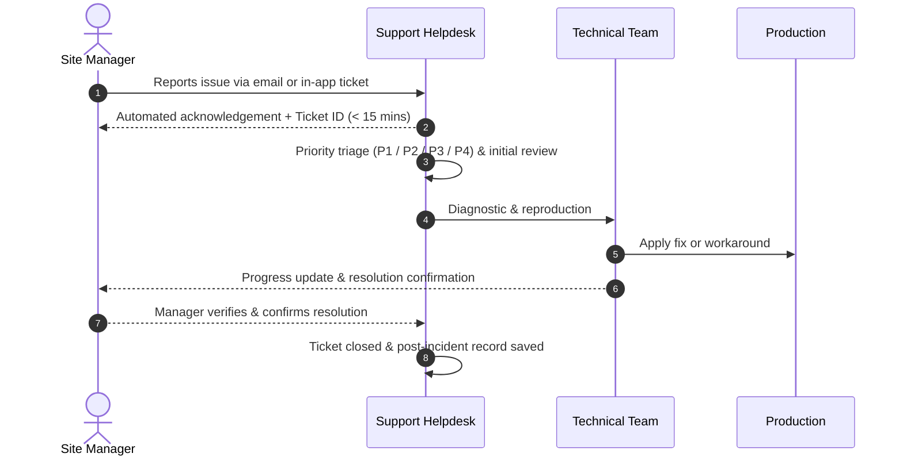
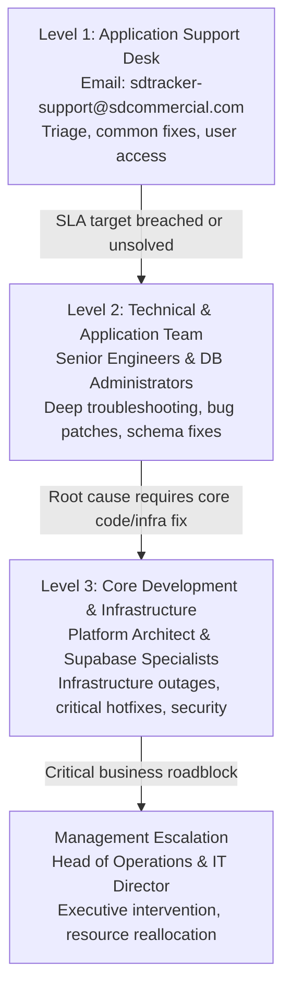

# SDTracker – Application Support, SLA & Change Management Guide

> **Audience:** Property General Managers, Operations Directors, Shift Leads & Business Stakeholders  
> **Application:** SDTracker WebCRM (Commercial Property & Operations Management)  
> **Status:** Production Ready  

---

## 1. Support

### What SDTracker Support Covers
SDTracker Support provides day-to-day operational and technical assistance for all authorized users across properties. Support covers:

* **Application access & login issues:** Password resets, account lockouts, site-assignment corrections, multi-property permission switches.
* **Application errors or failures:** Screen crashes, red error banners, form submission failures, or unresponsive views.
* **Data & display issues:** Missing audit records, discrepancies in totals/KPI cards, broken table filters, or incorrect date range queries.
* **Performance problems:** Page load slowness, slow report exports, search lag, or database connection timeouts.
* **Existing functionality not working as expected:** Broken file attachments, photo upload failures, digital signature capture errors, or notification failures.
* **User support & questions:** Guidance on using modules (Daily Audits, Welfare, Maintenance, Staff Directory, Compliance Tracker).
* **Integration-related issues:** Supabase real-time sync dropouts, automated email dispatch failures, or CSV/PDF export issues.
* **Security & access issues:** Reporting suspicious activity, immediate offboarding of departing staff, or auditing unauthorized permission changes.

---

### How to Report an Issue
When an issue occurs, any manager or staff member can report it using either of the following channels:

* **Email Support Desk:** `sdtracker-support@sdcommercial.com`
* **In-App Helpdesk:** Click the **"Help & Support"** icon in the SDTracker bottom navigation bar to open a ticket directly.
* **Emergency Hotline (P1 Outages Only):** `+44 (0) 20 8000 0111` (Available 24/7 / 365)

#### Information to Include in Your Report:
To help support resolve your ticket as fast as possible, please provide:
1. **Property / Site Name:** (e.g. *Crown Plaza – Manchester*)
2. **Module / Screen:** (e.g. *Daily Audits → Health & Safety Checklist*)
3. **What happened:** A short description of the problem and what you were trying to do.
4. **Who is affected:** Just yourself, a specific shift team, or the entire property?
5. **Screenshot or Error Message:** A screenshot or mobile photo of the error banner or unexpected screen.

---

### What Happens After an Issue is Reported



1. **Immediate Acknowledgement:** You will receive a confirmation email with a unique Ticket ID within 15 minutes.
2. **Triage & Priority Assignment:** A support engineer reviews the impact and sets the priority (P1 to P4).
3. **Investigation & Workaround:** The team investigates logs and database activity. If a permanent fix takes time, an immediate workaround is provided so you can keep working.
4. **Resolution & Verification:** Once fixed, you will receive a resolution notice explaining what was resolved.
5. **Closure Confirmation:** The ticket is only closed after you or your team confirm that the feature is functioning properly.

---

## 2. SLA & Priority Matrix

Service Level Agreements (SLAs) ensure critical issues receive immediate intervention while minor tasks are scheduled efficiently.

| Priority | Description | Examples | Initial Response Target | Target Resolution / Workaround |
| :---: | :--- | :--- | :---: | :---: |
| 🔴 **P1 Critical** | SDTracker unavailable for all/majority of users, or critical business operation completely halted. | • Complete login failure across sites<br>• Database connection down<br>• Audits cannot be saved anywhere | **30 mins**<br>*(24/7 coverage)* | **4 hours** |
| 🟠 **P2 High** | Major function unavailable with significant business impact; no simple workaround. | • Audit submission failing for an entire site<br>• Rota / Staff directory blank<br>• PDF compliance exports failing | **1 hour**<br>*(Business hours)* | **8 business hours** |
| 🟡 **P3 Medium** | Issue affecting individual users or non-critical functionality; practical workaround available. | • Search filter acting sluggish<br>• Single user cannot view photo attachment<br>• Minor formatting glitch in chart | **4 business hours** | **3 business days** |
| 🟢 **P4 Low** | Minor issue, question, cosmetic defect, or low-impact general inquiry. | • Typo in field label<br>• Request to re-order table columns<br>• General "how-to" usage question | **1 business day** | **5 to 10 business days** |

> **Note on Resolution Targets:** Resolution times are target times and may vary depending on the complexity of the issue, root-cause investigation, or any third-party infrastructure providers involved (e.g. Supabase, hosting provider). Workarounds that restore business continuity may be applied first while permanent code patches are tested.

---

## 3. Changes & Enhancements

To keep SDTracker stable, reliable, and compliant, all modifications follow a structured review process. This prevents ad-hoc changes from unintentionally breaking workflows for other sites or managers.

### Change Types & Definitions

* **Bug Fix:** Existing functionality is broken or not behaving as documented (e.g. date picker selects the wrong day).
* **Change:** Modifying an existing feature (e.g. adding a new field or dropdown option to customer/site records).
* **Enhancement:** Adding brand-new capabilities or views (e.g. building a new commercial welfare dashboard or a new executive summary report).
* **Process Change:** Modifying an operational rule (e.g. requiring two manager signatures instead of one before an audit can be finalized).

---

### How Managers Request a Change
Submit all change and enhancement requests to `product@sdcommercial.com` using this simple template:

| Template Field | What to Provide |
| :--- | :--- |
| **What needs to change?** | Clear description of the proposed feature or modification. |
| **Why is the change required?** | What operational challenge or inefficiency does this solve? |
| **Business benefit / reason:** | Time saved, improved regulatory compliance, error reduction, or financial accuracy. |
| **Who will be affected?** | One specific site, all site managers, shift staff, or head office only? |
| **Required date:** | Desired implementation date (please specify if tied to a statutory or brand deadline). |
| **Examples / Screenshots:** | Mockups, spreadsheets, or photos illustrating what you want to see. |
| **Business Priority:** | Low / Medium / High / Regulatory Urgent. |

---

### The 9-Stage Change Process

```
[1. Request] ──> [2. Review] ──> [3. Impact Assessment] ──> [4. Approval] ──> [5. Development]
                                                                                   │
[9. Verification] <── [8. Production Release] <── [7. User Acceptance (UAT)] <── [6. Testing]
```

1. **Request:** Manager submits the Change Request template.
2. **Review:** Product team reviews request during the weekly sprint review (every Tuesday).
3. **Impact Assessment:** Technical team checks impacts on database schemas, mobile viewports, and existing reports.
4. **Approval:** Operations Lead signs off on scope and priority.
5. **Development:** Engineers build the change in an isolated staging environment.
6. **Testing:** Automated test suites run (`npm run test:unit`) to ensure zero regressions.
7. **User Acceptance (UAT):** Requesting manager previews and tests the change in staging.
8. **Production Release:** Zero-downtime release deployed during standard weekly maintenance window.
9. **Verification:** Live sanity check confirms the feature is operational in production.

---

## 4. Escalation & Communication

### Escalation Hierarchy
If an issue is not progressing within the agreed SLA targets or business impact has escalated, managers have a clear, guaranteed escalation path:



| Escalation Level | Contact Role | When to Escalate | Target Response |
| :--- | :--- | :--- | :--- |
| **Level 1 – App Support** | Support Helpdesk Team | Initial point of contact for all tickets. | As per SLA (30m – 4h) |
| **Level 2 – Technical Team** | Senior Technical Lead | Ticket has not received update within SLA or workaround failed. | Within **1 hour** |
| **Level 3 – Infrastructure** | Principal Architect | Complex system defect, data sync outage, or security concern. | Within **2 hours** |
| **Management Escalation** | Head of Operations / IT Director | P1 outage exceeding 2 hours or urgent legal/statutory risk. | Immediate (< 30 mins) |

---

### Emergency Issues (P1 Outage Workflow)
For critical production incidents, the support and engineering teams immediately activate the emergency restore procedure:

$$\text{Incident Triggered} \longrightarrow \text{Immediate Containment/Fix} \longrightarrow \text{Service Restoration} \longrightarrow \text{Root Cause Review} \longrightarrow \text{Permanent Patch} \longrightarrow \text{Incident Closure}$$

1. **Containment & Hotfix:** Priority is 100% focused on restoring operational access (rolling back recent changes or switching to backup instances).
2. **Service Restoration:** Service is brought back online within the 4-hour target.
3. **Root Cause Review (Post-Mortem):** An engineering review identifies why the incident occurred and what guardrails prevent recurrence.
4. **Closure Report:** Affected managers receive a 1-page summary explaining cause, resolution, and future safeguards.

---

### What Managers Can Expect from Support
Every manager interacting with SDTracker Support can rely on the following commitments:
* **Prompt Acknowledgement:** Instant confirmation that your request has been logged.
* **Appropriate Priority Assignment:** Objective triage based on real operational impact.
* **Regular Status Updates:** Proactive updates every 30 minutes for P1 incidents, and daily updates for active P2/P3 tickets.
* **Clear Resolution Estimates:** No vague answers; you will always be given an expected timeline.
* **Advance Notification of Major Changes:** Advance notice before any UI or workflow changes take effect.
* **User Acceptance Testing (UAT):** Opportunities to test and approve significant enhancements before they go live.
* **Active Escalation:** Automatic handoff to senior managers whenever SLA targets are at risk.
* **Formal Closure Confirmation:** No ticket is closed without confirming that the solution works for you on-site.

---

## 5. Maintenance & Releases

### Planned Maintenance Policy
To ensure SDTracker remains fast, secure, and up-to-date, routine system maintenance and minor upgrades are scheduled during off-peak hours.

* **Standard Maintenance Window:** Every **Tuesday between 02:00 AM and 03:00 AM GMT** (lowest hotel occupancy and audit volume period).
* **Advance Notice Policy:** Operations managers receive email notification at least **48 hours in advance** for any maintenance requiring brief downtime (> 5 minutes).
* **Zero Data Loss Guarantee:** Maintenance operations never affect saved audits, staff records, or uploaded evidence. Browser-level local caching protects any in-progress forms.

#### Planned Maintenance Notices Always Include:
1. Exact Date, Time, and Expected Duration.
2. Summary of what is being updated or optimized.
3. Expected user impact (e.g. *"Read-only access for 10 minutes"*).
4. Any required action (e.g. *"Log out and press Ctrl+Shift+R after 03:00 AM"*).
5. Post-maintenance completion confirmation email.

---

### Known Issues & Quick Workarounds

To keep teams operating without delays, check these common items before logging a ticket:

| Symptom | Probable Cause | Instant Workaround | Permanent Action |
| :--- | :--- | :--- | :--- |
| **New features or buttons missing after an announced update** | Browser has cached previous JavaScript bundles. | Press **`Ctrl + Shift + R`** (Windows) or **`Cmd + Shift + R`** (Mac) to hard-refresh. | Automatic cache-busting headers deployed on server. |
| **Cannot see property records in dashboard** | Site switcher in the top navigation bar is scoped to a different site. | Click property dropdown in the top header and select your hotel/location. | Set default site in user profile settings. |
| **Photo attachment failed to upload on mobile** | Device momentarily dropped cellular / hotel Wi-Fi signal. | Re-connect Wi-Fi; draft is preserved automatically in local storage. Click "Retry Upload". | Offline sync engine will queue uploads once connection restores. |
| **Report export produces empty spreadsheet** | Active date filter range has no recorded audits (e.g. filter set to future date). | Reset date range filter to "This Month" or "Last 30 Days" and re-export. | Default filter logic automatically falls back to current month. |

---

## 6. Key Support Contacts Directory

Save these contacts for quick reference across all properties:

| Contact Role | Name / Desk | Email | Telephone | Availability |
| :--- | :--- | :--- | :--- | :--- |
| **Standard Support Desk** | SDTracker Helpdesk | `sdtracker-support@sdcommercial.com` | In-App Ticket | Mon–Fri, 08:00 – 18:00 GMT |
| **Emergency Outages (P1)** | Incident Duty Lead | `helpdesk-p1@sdcommercial.com` | +44 (0) 20 8000 0111 | 24/7 / 365 |
| **Product & Enhancements** | Product Management | `product@sdcommercial.com` | — | Weekly Sprint Review |
| **Application Owner** | Operations IT Lead | `lead-ops@sdcommercial.com` | +44 (0) 20 8000 0112 | Mon–Fri, 09:00 – 17:00 GMT |
| **Executive Escalation** | Head of Operations | `exec-escalations@sdcommercial.com` | +44 (0) 20 8000 0100 | As needed for critical escalations |
