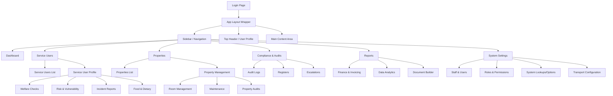

# SD Tracker UI/UX Wireflow & Application Skeleton

This document provides a comprehensive overview of the SD Tracker application's architecture from a UI/UX and user flow perspective. It includes 2D layout wireframes, module navigation, and workflow sequences.

## 1. Application Sitemap (Mermaid Wireflow)

The following diagram maps out the primary navigation, links, and logical grouping of pages within the application. 



---

## 2. Global Layout Skeleton (2D Wireframe)

The core architecture follows a standard dashboard layout (2D). This layout ensures scalability and consistent user experience.

```text
+-----------------------------------------------------------------------------+
|  [Logo] SD Tracker    |  [Search Bar]                 | [Notifications] [User]|
+-----------------------+-------------------------------+---------------------+
|                       |                                                     |
| [ ] Dashboard         |   +---------------------------------------------+   |
| [ ] Service Users     |   |                                             |   |
| [ ] Properties        |   |    Page Header (Breadcrumbs, Actions)       |   |
| [ ] Incident Reports  |   |    [ < Back ]  [Title]         [+ New]      |   |
| [ ] Compliance        |   +---------------------------------------------+   |
| [ ] Tasks             |   |                                             |   |
| [ ] Welfare           |   |                                             |   |
| [ ] Registers         |   |    +-------------------+ +-------------+    |   |
| [ ] Finance           |   |    |                   | |             |    |   |
| [ ] Settings          |   |    |    Data Grid      | |   Filter    |    |   |
|                       |   |    |    / Chart        | |   Panel     |    |   |
|                       |   |    |                   | |             |    |   |
|                       |   |    +-------------------+ +-------------+    |   |
|                       |   |                                             |   |
| [Collapse Sidebar]    |   +---------------------------------------------+   |
+-----------------------+-----------------------------------------------------+
```

---

## 3. High-Level Workflows

### A. The "Service User" Onboarding Flow
1. **User Action:** Navigates to *Service Users* -> Clicks `[+ Add New]`
2. **UI Component:** Multi-step wizard modal or form.
   - **Step 1:** Basic Details (Name, DOB, ID).
   - **Step 2:** Needs & Vulnerabilities (Dietary, Medical, Risks).
   - **Step 3:** Room Allocation (Select Property & Room).
3. **System Action:** Creates record, assigns room status, initializes compliance tasks (e.g., initial welfare check scheduling).
4. **Result:** Redirected to the Service User's detailed profile view.

### B. Incident Reporting (IR) Flow
1. **User Action:** Clicks `[Log Incident]` from Dashboard or Service User profile.
2. **UI Component:** Slider panel (Drawer) opens on the right side.
3. **Input:** Select Service User(s), Property, Date/Time, Severity, and Description.
4. **Trigger:** If Severity is `High`, workflow triggers notification to Managers.
5. **Result:** Incident is logged in the `IR` module and linked to the respective property and service user.

### C. Compliance & Audits Flow
1. **User Action:** Quality Assurance team views *Compliance* Dashboard.
2. **UI Component:** Kanban board or list of pending property audits.
3. **Execution:** User clicks into an Audit. A form loads with a checklist (Fire safety, cleanliness, etc.).
4. **Result:** Pass/Fail logged. Failed items automatically generate records in the *Maintenance* module.

---

## 4. Sub-Module Conceptual Directory

Based on the application structure, here is how the modules interlock:

- **Auth & Roles:** Manages login state, RBAC (Role-Based Access Control). Overlays all pages.
- **Properties & Rooms:** The physical locations. Connected to `Maintenance` and `PropertyManagement`.
- **Service Users:** The core entities. Linked to `Welfare`, `Challenging` behavior, `Vulnerable` flags, `GP` registrations, and `Food`.
- **Operations:** `IR` (Incident Reports), `Escalations`, `Registers` (daily signing), `Transport`.
- **Admin/Backoffice:** `Finance` (billing), `Reports`, `DocumentBuilder` (generating PDFs/Word docs), `Audit`.

## 5. 3D Architectural Perspective (Mental Model)

To visualize the app in 3D (data depth):

- **Z-Index 0 (Foundation):** Authentication, Database context (`AppContext`), Theme settings.
- **Z-Index 1 (Structure):** The main Shell (Sidebar, Header, Routing layer).
- **Z-Index 2 (Data Views):** The flat lists and grids (List of Properties, List of Users).
- **Z-Index 3 (Deep Dive):** Individual Profile Views (Service User Profile tabs).
- **Z-Index 4 (Interactive Overlay):** Modals, Drawers (right-side slide-outs for quick edits), Toast Notifications.
